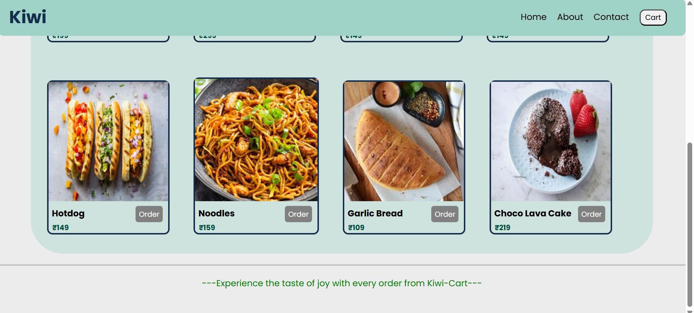
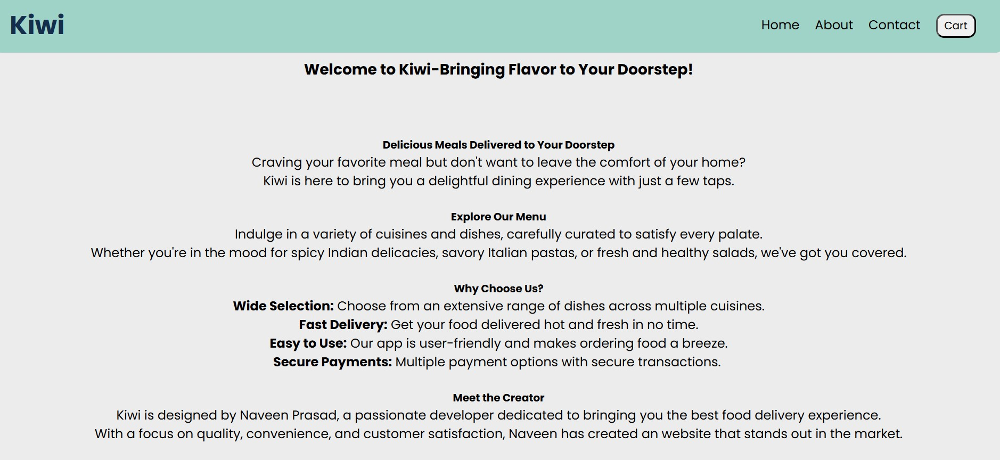
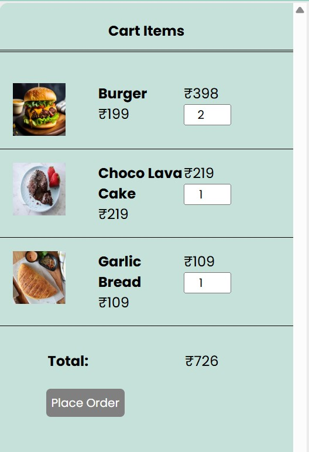

# Kiwi – Food Delivery Website 🍽️

A vibrant, responsive food delivery website designed to provide users with a smooth and engaging experience. Built using **HTML**, **CSS**, and **JavaScript**.

🔗 **Live Demo**: [https://kiwi-food-delivery.netlify.app/](https://kiwi-food-delivery.netlify.app/)

---

## 🚀 Features

- 🍕 Stylish and interactive landing page
- 🧾 Well-structured food categories
- 📱 Fully responsive design for all devices
- ⚡ Smooth scrolling and transitions
- 🖱️ Hover effects and user-friendly layout

---

## 🛠 Tech Stack

- **HTML5**
- **CSS3**
- **JavaScript**

---

## 📸 Screenshots

---